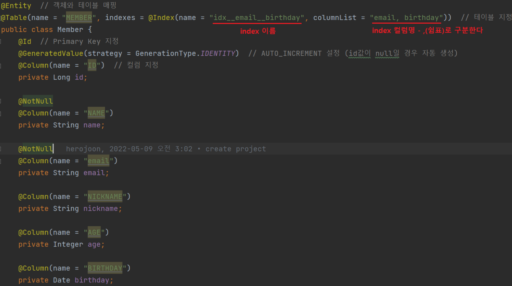

# 반려동물 프로젝트
### [소프트웨어 마에스트로]
기간: 2023.05 - 2023.11  
인원: Spring 2명, iOS 1명

### 사용한 기술스택
- 구조: Layered Architecture
- 언어: Java 17
- 프레임워크 & 라이브러리: Spring Boot 3.1, Spring Security, Spring Data JPA, QueryDsl, OpenFeign, Validation, Lombok
- 인증 & API 관리: JWT, Apple Login, Kakao Login, Swagger
- 데이터베이스 & 캐싱: MySQL, H2, Redis, Elasticsearch
- 클라우드 & 배포 서비스: AWS ElasticBeanstalk, AWS EC2, AWS RDS, AWS Route53, AWS S3, AWS ELB(ALB), Docker, Docker-Compose
- CI/CD: Github Actions
- 모니터링 & 로깅: SLF4J(Logback), Sentry, ELK (Elasticsearch, Logstash, Kibana), Prometheus, Grafana
- 테스트 도구: JUnit5
- 프로젝트 관리 & 협업 커뮤니케이션 도구: Jira, Figma, Notion, Discord, KakaoTalk, Github
- 문자 서비스: CoolSMS
- 정적 분석 도구: Sonarqube


# 아키텍처


# ERD


### 동시성 문제 해결

1. 동시성 문제 발생
   - 상황: 회원 가입 요청이 0.001ms 차이로 두 번 오는 동시성 문제 발생
   - 최종 해결: Email 컬럼에 unique key 제약조건을 추가하여 공통 예외 처리로 해결.


### 동시성 이슈 해결하는 방법 정리
https://github.com/kwongio/race-condition


# AWS Elastic Beanstalk 배포 문제 해결
1. 로드밸런서 Health Check 실패:
   - 문제: 루트 경로(/)에 API가 없어 Health Check가 실패함.
   - 해결: 루트 경로에 Health Check API를 만들어 문제를 해결함.
2. Data.sql로 인한 중복 초기값 세팅:
   - 문제: 초기 데이터 설정 중복.
   - 해결: application.yml의 설정을 spring.sql.init.mode:never로 변경하여 해결.
3. GitHub Actions의 Timeout 문제:
   - 문제: wait_for_environment_recovery의 기본값인 30초 내에 배포가 완료되지 않음.
   - 해결: GitHub Actions의 wait_for_environment_recovery를 180초로 조정하고, 인스턴스 성능을 향상시켜 문제 해결.  
https://velog.io/@kjgi73k/Elastic-Beanstalk-Environment-still-has-health-Grey-%ED%95%B4%EA%B2%B0


### No Offset 성능 이슈
https://jojoldu.tistory.com/528

### Page

- **카운트 쿼리 실행**: 전체 데이터 수를 계산하기 위해 추가적인 카운트 쿼리를 실행
- **전체 페이지 정보 제공**: 전체 페이지 수와 전체 요소 수를 포함
- **메모리 사용량과 성능**: 큰 데이터셋 처리 시 카운트 쿼리로 인해 성능 저하와 높은 메모리 사용량이 발생할 수 있음
- **적합한 사용 사례**: 정확한 페이지네이션 정보가 필요한 경우(예: 웹 페이지네이션).

### Slice

- **카운트 쿼리 실행 안 함**: 전체 데이터 수 계산을 위한 추가 쿼리 없이 현재 페이지 데이터와 다음 페이지 존재 여부만 제공
- **제한적 정보 제공**: 전체 페이지 수나 전체 요소 수 정보를 제공하지 않음
- **메모리 사용량과 성능**: 카운트 쿼리가 없어 상대적으로 더 낮은 메모리 사용량과 더 빠른 성능을 제공
- **적합한 사용 사례**: 무한 스크롤 또는 "더 보기" 기능이 있는 경우처럼, 사용자가 데이터를 순차적으로 탐색하는 인터페이스


### Spring Data Jpa에서 해결하기

기존 offset 방식의 페이징 Page사용
```java
public interface UserRepository extends JpaRepository<User, Long> {
    Page<User> findByLastName(String lastName, Pageable pageable);
}
```
offset 방식의 Json 결과
```json
{
  "content": [
    {
      "id": 1,
      "firstName": "John",
      "lastName": "Doe",
      "email": "john.doe@example.com"
    },
    {
      "id": 2,
      "firstName": "Jane",
      "lastName": "Doe",
      "email": "jane.doe@example.com"
    }
  ],
  "pageable": {
    "sort": {
      "empty": false,
      "sorted": true,
      "unsorted": false
    },
    "offset": 0,
    "pageSize": 10,
    "pageNumber": 0,
    "paged": true,
    "unpaged": false
  },
  "last": false,
  "totalPages": 5,
  "totalElements": 50,
  "size": 10,
  "number": 0,
  "sort": {
    "empty": false,
    "sorted": true,
    "unsorted": false
  },
  "first": true,
  "numberOfElements": 10,
  "empty": false
}

```


no offset 방식 Slice 사용
```java
public interface UserRepository extends JpaRepository<User, Long> {
    Slice<User> findByFirstName(String firstName, Pageable pageable);
}
```

no offset 방식의 Json 결과
```json
{
  "content": [
    {
      "id": 3,
      "firstName": "Alice",
      "lastName": "Smith",
      "email": "alice.smith@example.com"
    },
    {
      "id": 4,
      "firstName": "Bob",
      "lastName": "Brown",
      "email": "bob.brown@example.com"
    }
  ],
  "pageable": {
    "sort": {
      "empty": false,
      "sorted": true,
      "unsorted": false
    },
    "offset": 0,
    "pageSize": 10,
    "pageNumber": 0,
    "paged": true,
    "unpaged": false
  },
  "last": false, // 이 값이 false이면 다음 페이지가 존재함을 의미
  "size": 10,
  "number": 0,
  "sort": {
    "empty": false,
    "sorted": true,
    "unsorted": false
  },
  "numberOfElements": 10,
  "first": true,
  "empty": false
}

```

### private 메소드 Transaction 적용 안되는 문제해결하기
https://cobbybb.tistory.com/17

트랜잭션이 적용되지 않는 경우

1. Private 메소드에서 @Transactional 사용
```java
@Service
public class MyService {

    public void publicMethod() {
        this.privateTransactionalMethod(); // 이 호출은 트랜잭션이 적용되지 않음
    }

    @Transactional
    private void privateTransactionalMethod() {
        // 트랜잭션 처리가 필요한 로직
    }
}

```


2. 클래스를 직접 생성한 경우
```java
@RestController
public class MyController {

    @GetMapping("/test")
    public String test() {
        MyService myService = new MyService(); // 직접 생성한 인스턴스
        myService.publicMethod(); // 이 호출에서는 @Transactional이 적용되지 않음
        return "test";
    }
}

@Service
public class MyService {

    @Transactional
    public void publicMethod() {
        // 트랜잭션 처리가 필요한 로직
    }
}

```

이 외에도 @Async @Cacheable같은 어노테이션도 스프링에서 프록시로 관리 되기 때문에 주의해서 사용해야한다.


### jpa @Column 어노테이션 제약조건 넣기
https://deveric.tistory.com/54
https://ttl-blog.tistory.com/114

### jpa 인덱스 생성하기
https://herojoon-dev.tistory.com/142



### request 요청 validation 넣기
https://dev-coco.tistory.com/123

### validation 유효성 검사 exceptionHandler로 처리하기
https://www.baeldung.com/spring-boot-bean-validation


### 일급 컬렉션 사용하기
https://jojoldu.tistory.com/412


### Spring Data Jpa @EntityGraph는 left join만 지원
https://www.inflearn.com/questions/17752/entitygraph-%EC%82%AC%EC%9A%A9%EC%8B%9C-%EC%A1%B0%EC%9D%B8-%ED%83%80%EC%9E%85%EC%9D%84-%EC%A0%95%ED%95%A0-%EC%88%98-%EC%9E%88%EB%82%98%EC%9A%94


### SQL explain 정리
https://haemanlee.tistory.com/26


### 스웨거 설정  
https://jeonyoungho.github.io/posts/Open-API-3.0-Swagger-v3-%EC%83%81%EC%84%B8%EC%84%A4%EC%A0%95/


### hibernate 6.0버전부터는  @OneToMany  distinct 자동으로 붙여줌
https://delvering.tistory.com/52


### 2개 이상의 OneToMany 자식 테이블에 Fetch Join을 선언했을때 MultipleBagFetchException 발생
https://jojoldu.tistory.com/457


### Entity에서 컬렉션  초기화하는 이유
https://www.inflearn.com/questions/903000/team%EC%97%94%ED%8B%B0%ED%8B%B0%EC%9D%98-members%EC%84%A0%EC%96%B8%EC%8B%9C-%EC%B4%88%EA%B8%B0%ED%99%94-%EC%9D%B4%EC%9C%A0


### 자바에서 시간의 길이를 구하는 방법 ChronoUnit
 https://www.daleseo.com/java8-duration-period/


### querydsl count쿼리 분리하는 이유
https://nomoreft.tistory.com/45


### Response json에서 boolean의 is가 생략되는 문제
https://gimquokka.github.io/spring/Spring_Jackson_is_%EC%83%9D%EB%9E%B5%EB%AC%B8%EC%A0%9C/


### querydsl  OneToMany관계에서 fetch join으로 페이지네이션을 할 때
https://tecoble.techcourse.co.kr/post/2020-10-21-jpa-fetch-join-paging/
https://javabom.tistory.com/104
https://github.com/cheese10yun/blog-sample/blob/master/jpa-fetch-join/README.md
https://choiyeonho903.tistory.com/155


### in query로 해결하는법
```java
@Override
    public Page<Like> findByUserIdAndPostStatus(Long userId, PostStatusType postStatusType, Pageable pageable) {
//이전 코드
//                 List<Like> contents = jpaQueryFactory.selectFrom(like)
//                .leftJoin(like.post, post).fetchJoin()
//                .leftJoin(like.post.subCategory, subCategory).fetchJoin()
//                .where(like.user.id.eq(userId).and(eqPostStatusType(postStatusType)))
//                .join(like.post.like, like2).fetchJoin()
//                .offset(pageable.getOffset())  실행 x
//                .limit(pageable.getPageSize()) 실행 x
//                .fetch();


        QLike like2 = new QLike("like2");

        //in query로 해결하는법
        List<Long> likeId = jpaQueryFactory.select(like.id)
                .from(like)
                .offset(pageable.getOffset())
                .limit(pageable.getPageSize())
                .fetch();

        List<Like> contents = jpaQueryFactory.selectFrom(like)
                .leftJoin(like.post, post).fetchJoin()
                .leftJoin(like.post.subCategory, subCategory).fetchJoin()
                .join(like.post.like, like2).fetchJoin()
                .where(like.user.id.eq(userId).and(eqPostStatusType(postStatusType)), like.id.in(likeId))
                .fetch();

        JPAQuery<Long> countQuery = jpaQueryFactory
                .select(like.count())
                .from(like)
                .where(like.user.id.eq(userId).and(eqPostStatusType(postStatusType)));

        return PageableExecutionUtils.getPage(contents, pageable, countQuery::fetchOne);
    }

```

### 기존 방식에러
warn 로그가 발생하고
페이징 쿼리를 보면 limit와 offset이 적용이 안되어 있다.
모든 데이터를 가져와서 페이징을 하는 것이다.
[HHH000104: firstResult/maxResults specified with collection fetch; applying in memory]

```
2023-07-19T15:45:57.477+09:00 DEBUG 25104 --- [nio-8080-exec-3] org.hibernate.SQL                        : 
    /* select
        apply 
    from
        Apply apply   
    left join
        fetch apply.post as post   
    left join
        fetch apply.post.subCategory as subCategory   
    left join
        fetch apply.post.like as like1 
    where
        apply.user.id = ?1 
        and apply.approval = ?2 */ select
            a1_0.apply_id,
            a1_0.approval,
            a1_0.comment,
            a1_0.create_date,
            a1_0.environment,
            a1_0.is_experience,
            a1_0.job,
            a1_0.open_talk,
            a1_0.people,
            p1_0.post_id,
            p1_0.adopter,
            p1_0.advantage,
            p1_0.age,
            p1_0.average_cost,
            p1_0.birth,
            p1_0.create_date,
            p1_0.disadvantage,
            p1_0.gender,
            l1_0.post_id,
            l1_0.like_id,
            l1_0.create_date,
            l1_0.update_date,
            l1_0.user_id,
            p1_0.main_category_id,
            p1_0.money,
            p1_0.name,
            p1_0.neutered,
            p1_0.reason,
            p1_0.region,
            p1_0.reports,
            p1_0.status,
            s1_0.sub_category_id,
            s1_0.main_category_id,
            s1_0.name,
            p1_0.thumbnail_image,
            p1_0.update_date,
            p1_0.user_id,
            p1_0.views,
            a1_0.region,
            a1_0.seller_id,
            a1_0.update_date,
            a1_0.url,
            a1_0.user_id 
        from
            applys a1_0 
        left join
            posts p1_0 
                on p1_0.post_id=a1_0.post_id 
        left join
            sub_categories s1_0 
                on s1_0.sub_category_id=p1_0.sub_category_id 
        left join
            likes l1_0 
                on p1_0.post_id=l1_0.post_id 
        where
            a1_0.user_id=? 
            and a1_0.approval=?

2023-07-19T15:45:57.485+09:00 DEBUG 25104 --- [nio-8080-exec-3] org.hibernate.SQL                        : 
    /* select
        count(apply) 
    from
        Apply apply 
    where
        apply.user.id = ?1 
        and apply.approval = ?2 */ select
            count(a1_0.apply_id) 
        from
            applys a1_0 
        where
            a1_0.user_id=? 
            and a1_0.approval=?
```


### Queryds인쿼리 최적화

```java

2023-07-19T15:40:11.206+09:00 DEBUG 19160 --- [nio-8080-exec-1] org.hibernate.SQL                        : 
    /* select
        apply.id 
    from
        Apply apply */ select
            a1_0.apply_id 
        from
            applys a1_0 offset ? rows fetch first ? rows only
2023-07-19T15:40:11.237+09:00 DEBUG 19160 --- [nio-8080-exec-1] org.hibernate.SQL                        : 
    /* select
        apply 
    from
        Apply apply   
    left join
        fetch apply.post as post   
    left join
        fetch apply.post.subCategory as subCategory   
    left join
        fetch apply.post.like as like1 
    where
        apply.user.id = ?1 
        and apply.approval = ?2 
        and apply.id in ?3 */ select
            a1_0.apply_id,
            a1_0.approval,
            a1_0.comment,
            a1_0.create_date,
            a1_0.environment,
            a1_0.is_experience,
            a1_0.job,
            a1_0.open_talk,
            a1_0.people,
            p1_0.post_id,
            p1_0.adopter,
            p1_0.advantage,
            p1_0.age,
            p1_0.average_cost,
            p1_0.birth,
            p1_0.create_date,
            p1_0.disadvantage,
            p1_0.gender,
            l1_0.post_id,
            l1_0.like_id,
            l1_0.create_date,
            l1_0.update_date,
            l1_0.user_id,
            p1_0.main_category_id,
            p1_0.money,
            p1_0.name,
            p1_0.neutered,
            p1_0.reason,
            p1_0.region,
            p1_0.reports,
            p1_0.status,
            s1_0.sub_category_id,
            s1_0.main_category_id,
            s1_0.name,
            p1_0.thumbnail_image,
            p1_0.update_date,
            p1_0.user_id,
            p1_0.views,
            a1_0.region,
            a1_0.seller_id,
            a1_0.update_date,
            a1_0.url,
            a1_0.user_id 
        from
            applys a1_0 
        left join
            posts p1_0 
                on p1_0.post_id=a1_0.post_id 
        left join
            sub_categories s1_0 
                on s1_0.sub_category_id=p1_0.sub_category_id 
        left join
            likes l1_0 
                on p1_0.post_id=l1_0.post_id 
        where
            a1_0.user_id=? 
            and a1_0.approval=? 
            and a1_0.apply_id in(?,?,?,?,?,?,?,?,?,?,?,?,?,?,?,?,?,?,?,?)

2023-07-19T15:40:11.275+09:00 DEBUG 19160 --- [nio-8080-exec-1] org.hibernate.SQL                        : 
    /* select
        count(apply) 
    from
        Apply apply 
    where
        apply.user.id = ?1 
        and apply.approval = ?2 */ select
            count(a1_0.apply_id) 
        from
            applys a1_0 
        where
            a1_0.user_id=? 
            and a1_0.approval=?


```